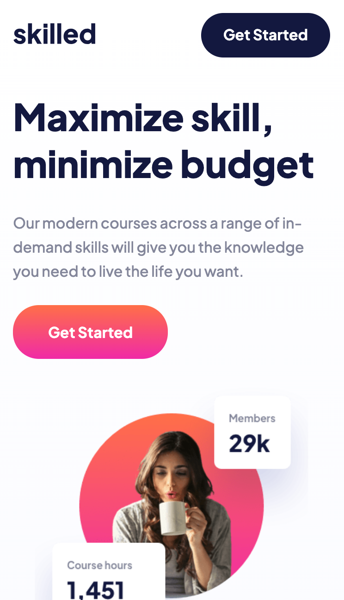
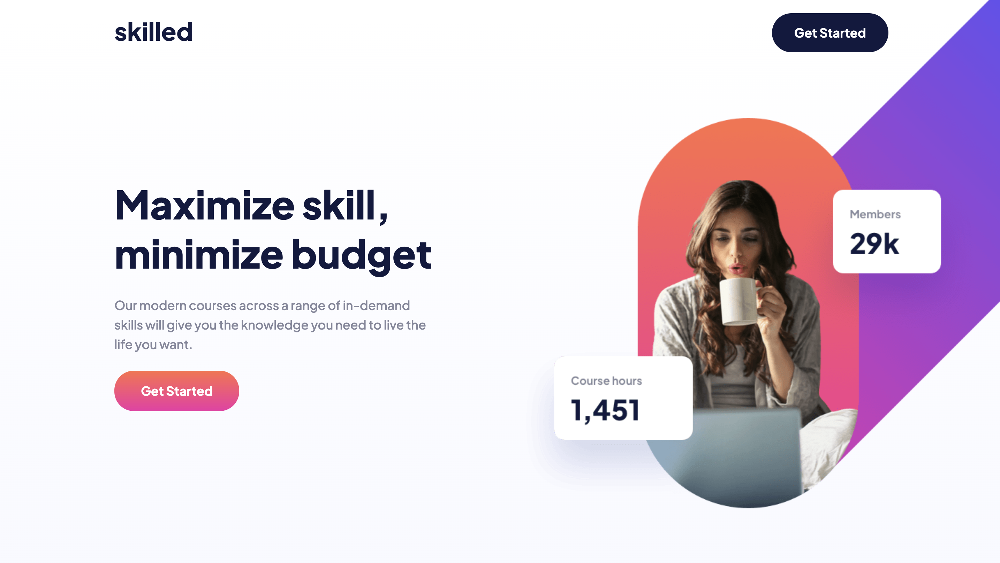

# Frontend Mentor - Skilled e-learning landing page

This is a solution to the [Skilled e-learning landing page challenge on Frontend Mentor](https://www.frontendmentor.io/challenges/skilled-elearning-landing-page-S1ObDrZ8q).

## Welcome! 👋

## Table of contents

- [Overview](#overview)
  - [The challenge](#the-challenge)
  - [Screenshot](#screenshot)
  - [Links](#links)
- [My process](#my-process)
  - [Built with](#built-with)
- [Author](#author)

## Overview

### The challenge

Users should be able to:

- View the optimal layout depending on their device's screen size
- See hover states for interactive elements

### Screenshot

| Mobile (375px)                                 | Desktop (1440px)                                 |
| ---------------------------------------------- | ------------------------------------------------ |
|  |  |

### Links

- [Solution](https://your-solution-url.com)
- [Live Site](https://your-live-site-url.com)

## My process

### Built with

- Semantic HTML5 markup
- CSS custom properties
- Flexbox
- CSS Grid
- Mobile-first workflow

## Author

- Website - [Portfolio](https://www.aniyaallen.com)
- Frontend Mentor - [@amallen1](https://www.frontendmentor.io/profile/amallen1)
